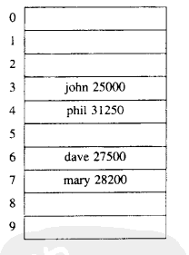

# ThreadLocal

<!-- toc -->

## 线程局部变量
在多线程环境下，之所以会有并发问题，就是因为不同的线程会同时访问同一个共享变量，例如下面的形式
```java
public class MultiThreadDemo {

    public static class Number {
        private int value = 0;

        public void increase() throws InterruptedException {
            value = 10;
            Thread.sleep(10);
            System.out.println("increase value: " + value);
        }

        public void decrease() throws InterruptedException {
            value = -10;
            Thread.sleep(10);
            System.out.println("decrease value: " + value);
        }
    }

    public static void main(String[] args) throws InterruptedException {
        final Number number = new Number();
        Thread increaseThread = new Thread(new Runnable() {
            @Override
            public void run() {
                try {
                    number.increase();
                } catch (InterruptedException e) {
                    e.printStackTrace();
                }
            }
        });

        Thread decreaseThread = new Thread(new Runnable() {
            @Override
            public void run() {
                try {
                    number.decrease();
                } catch (InterruptedException e) {
                    e.printStackTrace();
                }
            }
        });

        increaseThread.start();
        decreaseThread.start();
    }
}
```
在上面的代码中，increase 线程和 decrease 线程会操作同一个 number 中 value，那么输出的结果是不可预测的，因为当前线程修改变量之后但是还没输出的时候，变量有可能被另外一个线程修改，下面是一种可能的情况：
```
increase value: 10
decrease value: 10
```
一种解决方法是在 `increase()` 和 `decrease()` 方法上加上 synchronized 关键字进行同步，这种做法其实是将 value 的 **赋值** 和 **打印** 包装成了一个原子操作，也就是说两者要么同时进行，要不都不进行，中间不会有额外的操作。我们换个角度考虑问题，如果 value 只属于 increase 线程或者 decrease 线程，而不是被两个线程共享，那么也不会出现竞争问题。一种比较常见的形式就是局部（local）变量（这里排除局部变量引用指向共享对象的情况），如下所示：
```java
public void increase() throws InterruptedException {
    int value = 10;
    Thread.sleep(10);
    System.out.println("increase value: " + value);
}
```
不论 value 值如何改变，都不会影响到其他线程，因为在每次调用 increase 方法时，都会创建一个 value 变量，该变量只对当前调用 increase 方法的线程可见。借助于这种思想，我们可以对每个线程创建一个共享变量的副本，该副本只对当前线程可见（可以认为是线程私有的变量），那么修改该副本变量时就不会影响到其他的线程。一个简单的思路是使用 Map 存储每个变量的副本，将当前线程的 id 作为 key，副本变量作为 value 值，下面是一个实现：
```java
public class SimpleImpl {

    public static class CustomThreadLocal {
        private Map<Long, Integer> cacheMap = new HashMap<>();

        private int defaultValue ;

        public CustomThreadLocal(int value) {
            defaultValue = value;
        }

        public Integer get() {
            long id = Thread.currentThread().getId();
            if (cacheMap.containsKey(id)) {
                return cacheMap.get(id);
            }
            return defaultValue;
        }

        public void set(int value) {
            long id = Thread.currentThread().getId();
            cacheMap.put(id, value);
        }
    }

    public static class Number {
        private CustomThreadLocal value = new CustomThreadLocal(0);

        public void increase() throws InterruptedException {
            value.set(10);
            Thread.sleep(10);
            System.out.println("increase value: " + value.get());
        }

        public void decrease() throws InterruptedException {
            value.set(-10);
            Thread.sleep(10);
            System.out.println("decrease value: " + value.get());
        }
    }

    public static void main(String[] args) throws InterruptedException {
        final Number number = new Number();
        Thread increaseThread = new Thread(new Runnable() {
            @Override
            public void run() {
                try {
                    number.increase();
                } catch (InterruptedException e) {
                    e.printStackTrace();
                }
            }
        });

        Thread decreaseThread = new Thread(new Runnable() {
            @Override
            public void run() {
                try {
                    number.decrease();
                } catch (InterruptedException e) {
                    e.printStackTrace();
                }
            }
        });

        increaseThread.start();
        decreaseThread.start();
    }
}
```
但是上面的实现会存在下面的问题：
* 每个线程对应的副本变量的生命周期不是由线程决定的，而是由共享变量的生命周期决定的。在上面的例子中，即便线程执行完，只要 `number` 变量存在，线程的副本变量依然会存在（存放在 number 的 cacheMap 中）。但是作为特定线程的副本变量，该变量的生命周期应该由线程决定，线程消亡之后，该变量也应该被回收。
* 多个线程有可能会同时操作 cacheMap，需要对 cacheMap 进行同步处理。

为了解决上面的问题，我们换种思路，每个线程创建一个 Map，存放当前线程中副本变量，用 CustomThreadLocal 的实例作为 key 值，下面是一个示例：
```java
public class SimpleImpl2 {

    public static class CommonThread extends Thread {
        Map<Integer, Integer> cacheMap = new HashMap<>();
    }

    public static class CustomThreadLocal {
        private int defaultValue;

        public CustomThreadLocal(int value) {
            defaultValue = value;
        }

        public Integer get() {
            Integer id = this.hashCode();
            Map<Integer, Integer> cacheMap = getMap();
            if (cacheMap.containsKey(id)) {
                return cacheMap.get(id);
            }
            return defaultValue;
        }

        public void set(int value) {
            Integer id = this.hashCode();
            Map<Integer, Integer> cacheMap = getMap();
            cacheMap.put(id, value);
        }

        public Map<Integer, Integer> getMap() {
            CommonThread thread = (CommonThread) Thread.currentThread();
            return thread.cacheMap;
        }
    }

    public static class Number {
        private CustomThreadLocal value = new CustomThreadLocal(0);

        public void increase() throws InterruptedException {
            value.set(10);
            Thread.sleep(10);
            System.out.println("increase value: " + value.get());
        }

        public void decrease() throws InterruptedException {
            value.set(-10);
            Thread.sleep(10);
            System.out.println("decrease value: " + value.get());
        }
    }


    public static void main(String[] args) throws InterruptedException {
        final Number number = new Number();
        Thread increaseThread = new CommonThread() {
            @Override
            public void run() {
                try {
                    number.increase();
                } catch (InterruptedException e) {
                    e.printStackTrace();
                }

            }
        };

        Thread decreaseThread = new CommonThread() {
            @Override
            public void run() {
                try {
                    number.decrease();
                } catch (InterruptedException e) {
                    e.printStackTrace();
                }
            }
        };
        increaseThread.start();
        decreaseThread.start();
    }
}
```
在上面的实现中，当线程消亡之后，线程中 cacheMap 也会被回收，它当中存放的副本变量也会被全部回收，并且 cacheMap 是线程私有的，不会出现多个线程同时访问一个 cacheMap 的情况。在 Java 中，ThreadLocal 类的实现就是采用的这种思想，注意只是思想，实际的实现和上面的并不一样。

## 使用示例
Java 使用 ThreadLocal 类来实现线程局部变量模式，ThreadLocal 使用 set 和 get 方法设置和获取变量，下面是函数原型：
```java
public void set(T value);
public T get();
```
下面是使用 ThreadLocal 的一个完整示例：
```java
public class ThreadLocalDemo {
    private static ThreadLocal<Integer> threadLocal = new ThreadLocal<>();
    private static int value = 0;

    public static class ThreadLocalThread implements Runnable {
        @Override
        public void run() {
            threadLocal.set((int)(Math.random() * 100));
            value = (int) (Math.random() * 100);
            try {
                Thread.sleep(2000);
            } catch (InterruptedException e) {
                e.printStackTrace();
            }
            System.out.printf(Thread.currentThread().getName() + ": threadLocal=%d, value=%d\n", threadLocal.get(), value);
        }
    }

    public static void main(String[] args) throws InterruptedException {
        Thread thread = new Thread(new ThreadLocalThread());
        Thread thread2 = new Thread(new ThreadLocalThread());
        thread.start();
        thread2.start();
        thread.join();
        thread2.join();
    }
}
```
下面是一种可能的输出：
```
Thread-0: threadLocal=87, value=15
Thread-1: threadLocal=69, value=15
```
我们看到虽然 `threadLocal` 是静态变量，但是每个线程都有自己的值，不会受到其他线程的影响。

## 具体实现
ThreadLocal 的实现思想，我们在前面已经说了，每个线程维护一个 ThreadLocalMap 的映射表，映射表的 key 是 ThreadLocal 实例本身，value 是要存储的副本变量。ThreadLocal 实例本身并不存储值，它只是提供一个在当前线程中找到副本值的 key。 如下图所示：


> 图片来自 http://blog.xiaohansong.com/2016/08/06/ThreadLocal-memory-leak/

我们从下面三个方面看下 ThreadLocal 的实现：
* 存储线程副本变量的数据结构
* 如何存取线程副本变量
* 如何对 ThreadLocal 的实例进行 Hash

### ThreadLocalMap
线程使用 ThreadLocalMap 来存储每个线程副本变量，它是 ThreadLocal 里的一个静态内部类。ThreadLocalMap 也是采用的散列表（Hash）思想来实现的，但是实现方式和 HashMap 不太一样。我们首先看下散列表的相关知识：
#### 散列表
理想状态下，散列表就是一个包含关键字的固定大小的数组，通过使用散列函数，将关键字映射到数组的不同位置。下面是理想散列表的一个示意图：


> 图片来自 数据结构与算法分析: C语法描述

在理想状态下，哈希函数可以将关键字均匀的分散到数组的不同位置，不会出现两个关键字散列值相同（假设关键字数量小于数组的大小）的情况。但是在实际使用中，经常会出现多个关键字散列值相同的情况（被映射到数组的同一个位置），我们将这种情况称为散列冲突。为了解决散列冲突，主要采用下面两种方式：
* 分离链表法（separate chaining）
* 开放定址法（open addressing）

**分离链表法**  
分散链表法使用链表解决冲突，将散列值相同的元素都保存到一个链表中。当查询的时候，首先找到元素所在的链表，然后遍历链表查找对应的元素。下面是一个示意图：


> 图片来自 http://faculty.cs.niu.edu/~freedman/340/340notes/340hash.htm

**开放定址法**  
开放定址法不会创建链表，当关键字散列到的数组单元已经被另外一个关键字占用的时候，就会尝试在数组中寻找其他的单元，直到找到一个空的单元。探测数组空单元的方式有很多，这里介绍一种最简单的 -- 线性探测法。线性探测法就是从冲突的数组单元开始，依次往后搜索空单元，如果到数组尾部，再从头开始搜索（环形查找）。如下图所示：


> 图片来自 http://alexyyek.github.io/2014/12/14/hashCollapse/

关于两种方式的比较，可以参考 [这篇文章](http://www.nowamagic.net/academy/detail/3008060)。ThreadLocalMap 中使用开放地址法来处理散列冲突，而 HashMap 中使用的分离链表法。之所以采用不同的方式主要是因为：在 ThreadLocalMap 中的散列值分散的十分均匀，很少会出现冲突。并且 ThreadLocalMap 经常需要清除无用的对象，使用纯数组更加方便。

#### 实现
我们知道 Map 是一种 key-value 形式的数据结构，所以在散列数组中存储的元素也是 key-value 的形式。ThreadLocalMap 使用 Entry 类来存储数据，下面是该类的定义：
```java
static class Entry extends WeakReference <ThreadLocal <?>> {
    /** The value associated with this ThreadLocal. */
    Object value;

    Entry(ThreadLocal <?> k, Object v) {
        super(k);
        value = v;
    }
}
```
Entry 将 ThreadLocal 实例作为 key，副本变量作为 value 存储起来。注意 Entry 中对于 ThreadLocal 实例的引用是一个弱引用，该引用定义在 Reference 类（WeakReference的父类）中，下面是 `super(k)` 最终调用的代码：
```java
Reference(T referent) {
    this(referent, null);
}

Reference(T referent, ReferenceQueue <? super T> queue) {
    this.referent = referent;
    this.queue = (queue == null) ? ReferenceQueue.NULL : queue;
}
```
关于弱引用和为什么使用弱引用可以参考 [Java 理论与实践: 用弱引用堵住内存泄漏](https://www.ibm.com/developerworks/cn/java/j-jtp11225/) 和 [深入分析 ThreadLocal 内存泄漏问题](http://blog.xiaohansong.com/2016/08/06/ThreadLocal-memory-leak/)。下面看一下 ThreadLocalMap 的 set 函数
```java
private void set(ThreadLocal <?> key, Object value) {

    // We don't use a fast path as with get() because it is at
    // least as common to use set() to create new entries as
    // it is to replace existing ones, in which case, a fast
    // path would fail more often than not.

    Entry[] tab = table;
    int len = tab.length;
    // 根据 ThreadLocal 的散列值，查找对应元素在数组中的位置
    int i = key.threadLocalHashCode & (len - 1);

    // 使用线性探测法查找元素
    for (Entry e = tab[i]; e != null; e = tab[i = nextIndex(i, len)]) {
        ThreadLocal <?> k = e.get();
        // ThreadLocal 对应的 key 存在，直接覆盖之前的值
        if (k == key) {
            e.value = value;
            return;
        }
        // key为 null，但是值不为 null，说明之前的 ThreadLocal 对象已经被回收了，当前数组中的 Entry 是一个陈旧（stale）的元素
        if (k == null) {
            // 用新元素替换陈旧的元素，这个方法进行了不少的垃圾清理动作，防止内存泄漏，具体可以看源代码，没看太懂
            replaceStaleEntry(key, value, i);
            return;
        }
    }
    // ThreadLocal 对应的 key 不存在并且没有找到陈旧的元素，则在空元素的位置创建一个新的 Entry。
    tab[i] = new Entry(key, value);
    int sz = ++size;
    // cleanSomeSlot 清理陈旧的 Entry（key == null），具体的参考源码。如果没有清理陈旧的 Entry 并且数组中的元素大于了阈值，则进行 rehash。
    if (!cleanSomeSlots(i, sz) && sz >= threshold)
        rehash();
}
```
关于 set 方法，有几点需要地方：
*  `int i = key.threadLocalHashCode & (len - 1);`，这里实际上是对 len-1 进行了取余操作。之所以能这样取余是因为 len 的值比较特殊，是 2 的 n 次方，减 1 之后低位变为全 1，高位变为全 0。例如 16，减 1 之后对应的二进制为: 00001111，这样其他数字中大于 16 的部分就会被 0 与掉，小于 16 的部分就会保留下来，就相当于取余了。
* 在 replaceStaleEntry 和 cleanSomeSlots 方法中都会清理一些陈旧的 Entry，防止内存泄漏
* threshold 的值大小为 `threshold = len * 2 / 3;`
* rehash 方法中首先会清理陈旧的 Entry，如果清理完之后元素数量仍然大于 threshold 的 3/4，则进行扩容操作（数组大小变为原来的 2倍）
```java
private void rehash() {
    expungeStaleEntries();
    // Use lower threshold for doubling to avoid hysteresis
    if (size >= threshold - threshold / 4)
        resize();
}
```

我们再看一下 getEntry （没有 get 方法，就叫 getEntry）方法：
```java
private Entry getEntry(ThreadLocal <?> key) {
    int i = key.threadLocalHashCode & (table.length - 1);
    Entry e = table[i];
    if (e != null && e.get() == key)
        return e;
    else
        return getEntryAfterMiss(key, i, e);
}
```
因为 ThreadLocalMap 中采用开放定址法，所以当前 key 的散列值和元素在数组中的索引并不一定完全对应。所以在 get 的时候，首先会看 key 的散列值对应的数组元素是否为要查找的元素，如果不是，再调用 `getEntryAfterMiss` 方法查找后面的元素。
```java
private Entry getEntryAfterMiss(ThreadLocal <?> key, int i, Entry e) {
    Entry[] tab = table;
    int len = tab.length;

    while (e != null) {
        ThreadLocal < ? > k = e.get();
        if (k == key)
            return e;
        if (k == null)
            expungeStaleEntry(i);
        else
            i = nextIndex(i, len);
        e = tab[i];
    }
    return null;
}
```
最后看一下删除操作。删除其实就是将 Entry 的键值设为 null，变为陈旧的 Entry。然后调用 `expungeStaleEntry` 清理陈旧的 Entry。
```java
private void remove(ThreadLocal <?> key) {
    Entry[] tab = table;
    int len = tab.length;
    int i = key.threadLocalHashCode & (len - 1);
    for (Entry e = tab[i]; e != null; e = tab[i = nextIndex(i, len)]) {
        if (e.get() == key) {
            e.clear();
            expungeStaleEntry(i);
            return;
        }
    }
}
```

### 副本变量存取
前面说完了 ThreadLocalMap，副本变量的存取操作就很好理解了。下面是 ThreadLocal 中的 set 和 get 方法的实现：
```java
public void set(T value) {
    Thread t = Thread.currentThread();
    ThreadLocalMap map = getMap(t);
    if (map != null)
        map.set(this, value);
    else
        createMap(t, value);
}

public T get() {
    Thread t = Thread.currentThread();
    ThreadLocalMap map = getMap(t);
    if (map != null) {
        ThreadLocalMap.Entry e = map.getEntry(this);
        if (e != null) {
            @SuppressWarnings("unchecked")
            T result = (T) e.value;
            return result;
        }
    }
    return setInitialValue();
}
```
存取的基本流程就是首先获得当前线程的 ThreadLocalMap，将 ThreadLocal 实例作为键值传入 Map，然后就是进行相关的变量存取工作了。线程中的 ThreadLocalMap 是懒加载的，只有真正的要存变量时才会调用 createMap 创建，下面是 createMap 的实现：
```java
void createMap(Thread t, T firstValue) {
    t.threadLocals = new ThreadLocalMap(this, firstValue);
}
```
如果想要给 ThreadLocal 的副本变量设置初始值，需要重写 initialValue 方法，如下面的形式：
```java
ThreadLocal <Integer> threadLocal = new ThreadLocal() {
    protected Integer initialValue() {
        return 0;
    }
};
```

### ThreadLocal 散列值
当创建了一个 ThreadLocal 的实例后，它的散列值就已经确定了，下面是 ThreadLocal 中的实现：
```java
/**
 * ThreadLocals rely on per-thread linear-probe hash maps attached
 * to each thread (Thread.threadLocals and
 * inheritableThreadLocals).  The ThreadLocal objects act as keys,
 * searched via threadLocalHashCode.  This is a custom hash code
 * (useful only within ThreadLocalMaps) that eliminates collisions
 * in the common case where consecutively constructed ThreadLocals
 * are used by the same threads, while remaining well-behaved in
 * less common cases.
 */
private final int threadLocalHashCode = nextHashCode();

/**
 * The next hash code to be given out. Updated atomically. Starts at
 * zero.
 */
private static AtomicInteger nextHashCode =
    new AtomicInteger();

/**
 * The difference between successively generated hash codes - turns
 * implicit sequential thread-local IDs into near-optimally spread
 * multiplicative hash values for power-of-two-sized tables.
 */
private static final int HASH_INCREMENT = 0x61c88647;

/**
 * Returns the next hash code.
 */
private static int nextHashCode() {
    return nextHashCode.getAndAdd(HASH_INCREMENT);
}
```
我们看到 threadLocalHashCode 是一个常量，它通过 `nextHashCode()` 函数产生。`nextHashCode()` 函数其实就是在一个 AtomicInteger 变量（初始值为0）的基础上每次累加 0x61c88647，使用 AtomicInteger 为了保证每次的加法是原子操作。而 0x61c88647 这个就比较神奇了，它可以使 hashcode 均匀的分布在大小为 2 的 N 次方的数组里。下面写个程序测试一下:
```java
public static void main(String[] args) {
    AtomicInteger hashCode = new AtomicInteger();
    int hash_increment = 0x61c88647;
    int size = 16;
    List <Integer> list = new ArrayList <> ();
    for (int i = 0; i < size; i++) {
        list.add(hashCode.getAndAdd(hash_increment) & (size - 1));
    }
    System.out.println("original:" + list);
    Collections.sort(list);
    System.out.println("sort:    " + list);
}
```
我们将 size 设为 16，32 和 64 分别测试一下：
```
// size=16
original:[0, 7, 14, 5, 12, 3, 10, 1, 8, 15, 6, 13, 4, 11, 2, 9]
sort:    [0, 1, 2, 3, 4, 5, 6, 7, 8, 9, 10, 11, 12, 13, 14, 15]

// size=32
original:[0, 7, 14, 21, 28, 3, 10, 17, 24, 31, 6, 13, 20, 27, 2, 9, 16, 23, 30, 5, 12, 19, 26, 1, 8, 15, 22, 29, 4, 11, 18, 25]
sort:    [0, 1, 2, 3, 4, 5, 6, 7, 8, 9, 10, 11, 12, 13, 14, 15, 16, 17, 18, 19, 20, 21, 22, 23, 24, 25, 26, 27, 28, 29, 30, 31]

// size=64
original:[0, 7, 14, 21, 28, 35, 42, 49, 56, 63, 6, 13, 20, 27, 34, 41, 48, 55, 62, 5, 12, 19, 26, 33, 40, 47, 54, 61, 4, 11, 18, 25, 32, 39, 46, 53, 60, 3, 10, 17, 24, 31, 38, 45, 52, 59, 2, 9, 16, 23, 30, 37, 44, 51, 58, 1, 8, 15, 22, 29, 36, 43, 50, 57]
sort:    [0, 1, 2, 3, 4, 5, 6, 7, 8, 9, 10, 11, 12, 13, 14, 15, 16, 17, 18, 19, 20, 21, 22, 23, 24, 25, 26, 27, 28, 29, 30, 31, 32, 33, 34, 35, 36, 37, 38, 39, 40, 41, 42, 43, 44, 45, 46, 47, 48, 49, 50, 51, 52, 53, 54, 55, 56, 57, 58, 59, 60, 61, 62, 63]
```
可以看到随着 size 的变化，hashcode 总能均匀的分布。其实这就是 Fibonacci Hashing，具体可以参考 [这篇文章](http://hehaiqian.com/2015/07/25/hash1-0x61c88647/)。所以虽然 ThreadLocal 的 hashcode 是固定的，当 ThreadLocalMap 中的散列表调整大小（变为原来的 2 倍）之后重新散列，hashcode 仍能均匀的分布在散列表中。

## 应用场景
> 摘自 [Java并发编程：深入剖析ThreadLocal](http://www.cnblogs.com/dolphin0520/p/3920407.html)

最常见的ThreadLocal使用场景为 用来解决 数据库连接、Session管理等。如
```java
private static ThreadLocal < Connection > connectionHolder = new ThreadLocal < Connection > () {
    public Connection initialValue() {
        return DriverManager.getConnection(DB_URL);
    }
};

public static Connection getConnection() {
    return connectionHolder.get();
}
```
```java
private static final ThreadLocal threadSession = new ThreadLocal();

public static Session getSession() throws InfrastructureException {
    Session s = (Session) threadSession.get();
    try {
        if (s == null) {
            s = getSessionFactory().openSession();
            threadSession.set(s);
        }
    } catch (HibernateException ex) {
        throw new InfrastructureException(ex);
    }
    return s;
}
```
## 参考文章
* http://www.iteye.com/topic/103804
* http://www.jianshu.com/p/529c03d9b67e
* http://stackoverflow.com/questions/38994306/what-is-the-meaning-of-0x61c88647-constant-in-threadlocal-java
* http://jerrypeng.me/2013/06/thread-local-and-magical-0x61c88647/
* [ThreadLocal是否会引发内存泄露的分析（转）](http://www.cnblogs.com/softidea/p/4819866.html)
* [[Java并发包学习七]解密ThreadLocal](http://qifuguang.me/2015/09/02/[Java%E5%B9%B6%E5%8F%91%E5%8C%85%E5%AD%A6%E4%B9%A0%E4%B8%83]%E8%A7%A3%E5%AF%86ThreadLocal/)
* [数据结构与算法分析: C语法描述](https://github.com/Bzhnja/ebooks/blob/master/%E6%95%B0%E6%8D%AE%E7%BB%93%E6%9E%84%E4%B8%8E%E7%AE%97%E6%B3%95%E5%88%86%E6%9E%90%EF%BC%9AC%E8%AF%AD%E8%A8%80%E6%8F%8F%E8%BF%B0_%E5%8E%9F%E4%B9%A6%E7%AC%AC2%E7%89%88_%E9%AB%98%E6%B8%85%E7%89%88.pdf)
