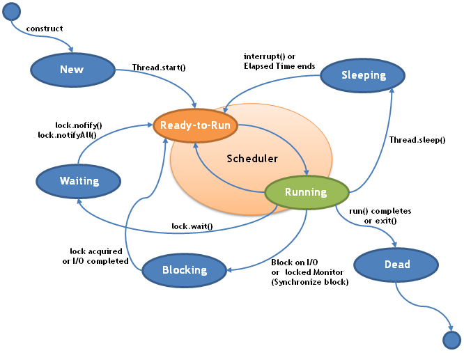

# 多线程
目录
<!-- toc -->

参考文章:
* [Java - Multithreading](https://www.tutorialspoint.com/java/java_multithreading.htm)
* [Multithreading in java with examples](http://beginnersbook.com/2013/03/multithreading-in-java/)


## HelloWorld
在 Java 中有两种方式创建线程，第一种方式是实现 `Runnable` 接口，第二种方式是继承 `Thread` 类，下面是使用示例：
```java
public class RunnableDemo implements Runnable{
    @Override
    public void run() {
        System.out.println("I am in runnable Demo");
    }

    public static void main(String[] args) {
        Thread thread = new Thread(new RunnableDemo());
        thread.start();
    }
}
```

```java
public class ThreadDemo extends Thread{
    @Override
    public void run() {
        System.out.println("I am in Thread Demo");
    }

    public static void main(String[] args) {
        Thread thread = new ThreadDemo();
        thread.start();
    }
}
```
如果启动线程，需要调用 `start` 方法，直接运行 `run` 不会启动新的线程。

## 线程状态
在线程执行期间，会经历多种状态，下面是一个示意图：


> 图片来自 https://avaldes.com/java-thread-states-life-cycle-of-java-threads/

下面是线程生命周期对应的几种状态
* New - 初始状态，线程刚被创建，但是还没有调用 `start` 方法
* Runnable(Ready to run) - 可运行状态，其他线程调用了该线程的 `start` 方法。该状态的位于可运行的线程池中，等待被线程调度选中，获得 CPU 的使用权。
* Running - 运行状态，Runnable 线程获得了 CPU 使用权，执行程序代码。
* Blocked - 阻塞状态，表示线程被锁阻塞。例如进入 `synchronized` 同步块时等待锁。
* Waiting - 等待状态，处于该状态的线程一个是调用了下面3个方法：`Object.wait`, `Thread.join` 或者 `LockSupport.park`。处于 Waiting 状态的线程需要等待其他线程做出一些特定行为，例如通过调用 `Object.wait()` 等待的线程需要另外一个线程执行 `Object.notify()` 或者 `Object.notifyAll()` 来唤醒。
* Time Waiting - 超时等待，当等待时间超过指定时间后会自行返回。
* Terminated - 终止状态，表示线程已经执行完毕

在 JDK 中定义了线程的六种状态，位于 `Thread.State` 中，下面是 `State` 的定义：
```java
public enum State {
    /**
     * Thread state for a thread which has not yet started.
     */
    NEW,

    /**
     * Thread state for a runnable thread.  A thread in the runnable
     * state is executing in the Java virtual machine but it may
     * be waiting for other resources from the operating system
     * such as processor.
     */
    RUNNABLE,

    /**
     * Thread state for a thread blocked waiting for a monitor lock.
     * A thread in the blocked state is waiting for a monitor lock
     * to enter a synchronized block/method or
     * reenter a synchronized block/method after calling
     * {@link Object#wait() Object.wait}.
     */
    BLOCKED,

    /**
     * Thread state for a waiting thread.
     * A thread is in the waiting state due to calling one of the
     * following methods:
     * <ul>
     *   <li>{@link Object#wait() Object.wait} with no timeout</li>
     *   <li>{@link #join() Thread.join} with no timeout</li>
     *   <li>{@link LockSupport#park() LockSupport.park}</li>
     * </ul>
     *
     * <p>A thread in the waiting state is waiting for another thread to
     * perform a particular action.
     *
     * For example, a thread that has called <tt>Object.wait()</tt>
     * on an object is waiting for another thread to call
     * <tt>Object.notify()</tt> or <tt>Object.notifyAll()</tt> on
     * that object. A thread that has called <tt>Thread.join()</tt>
     * is waiting for a specified thread to terminate.
     */
    WAITING,

    /**
     * Thread state for a waiting thread with a specified waiting time.
     * A thread is in the timed waiting state due to calling one of
     * the following methods with a specified positive waiting time:
     * <ul>
     *   <li>{@link #sleep Thread.sleep}</li>
     *   <li>{@link Object#wait(long) Object.wait} with timeout</li>
     *   <li>{@link #join(long) Thread.join} with timeout</li>
     *   <li>{@link LockSupport#parkNanos LockSupport.parkNanos}</li>
     *   <li>{@link LockSupport#parkUntil LockSupport.parkUntil}</li>
     * </ul>
     */
    TIMED_WAITING,

    /**
     * Thread state for a terminated thread.
     * The thread has completed execution.
     */
    TERMINATED;
}
```
